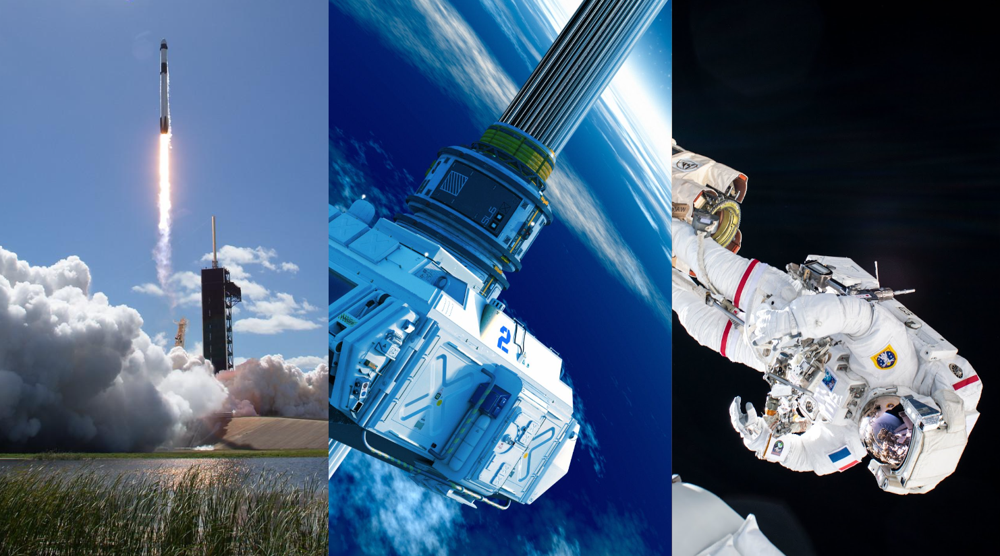
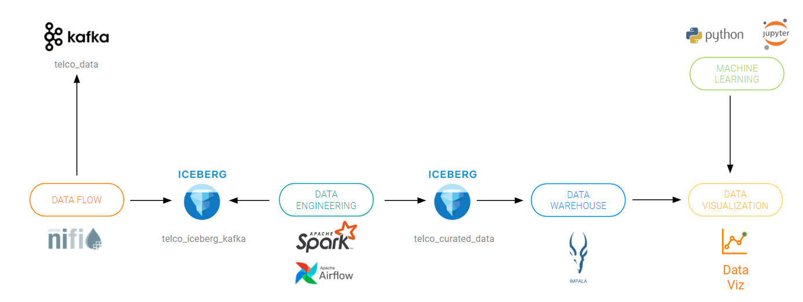

= Cloudera Technical Workshop

'''

Version : 1.0.0 `25th March 2024` +

'''
 +

== Introduction

*Cloudera Data Platform (CDP)* has been built from the ground up to support hybrid, multi-cloud data management in support of a Data Fabric architecture.
This workshop introduces CDP, with a focus on the data management capabilities that enable the Data Fabric and Data Lakehouse. The workshop will include 5 key components which are: *Cloudera Data Flow, Cloudera Data Engineering, Cloudera Data Warehouse, Cloudera Machine Learning & Data Visualization*. A brief description of the same is provided below in the below overview section.

If you are new to Cloudera Data Platform then please spend some time in knowing more about the platform by clicking https://www.cloudera.com/products/cloudera-data-platform.html[here] & https://docs.cloudera.com/?tab=cdp-public-cloud[here].

== Data Services
In this workshop, we will be getting to experience 4 out of the 5 key Data services that CDP offeres which covers the entire data lifecycle. They are: +

*_Cloudera DataFlow (CDF)_* offers a flow-based low-code development paradigm that aligns best with how developers design, develop, and test data distribution pipelines. With over 450+ connectors and processors across the ecosystem of hybrid cloud services—including data lakes, lakehouses, cloud warehouses, and on-premises sources—CDF-PC provides indiscriminate data distribution. https://www.cloudera.com/products/dataflow.html[Read More here].

*_Cloudera Data Engineering (CDE)_* is the only cloud-native service purpose-built for enterprise data engineering teams. Building on Apache Spark, Data Engineering is an all-inclusive data engineering toolset that enables orchestration automation with Apache Airflow, advanced pipeline monitoring, visual troubleshooting, and comprehensive management tools to streamline ETL processes across enterprise analytics teams. https://www.cloudera.com/products/data-engineering.html[Read More here].

*_Cloudera Data Warehouse (CDW)_* is a cloud service for creating self-service data warehouses and the underlying compute clusters for teams of business analysts. Data Warehouse is an auto-scaling, highly concurrent and cost effective analytics service that ingests high scale data anywhere, from structured, unstructured and edge sources. It supports hybrid and multi-cloud infrastructure models by seamlessly moving workloads between on-premise and any cloud for reports, dashboards, ad-hoc and advanced analytics, including AI, with consistent security and governance. https://www.cloudera.com/products/data-warehouse.html[Read More here].

*_Cloudera Machine Learning_* CDP Machine Learning enables enterprise data science teams to collaborate across the full data lifecycle with immediate access to enterprise data pipelines, scalable compute resources, and access to preferred tools. CDP Machine Learning optimizes ML workflows across your business with native and robust tools for deploying, serving, and monitoring models. With extended SDX for models, govern and automate model cataloging and then seamlessly move results to collaborate across CDP experiences including CDP Data Warehouse and CDP Operational Database. https://www.cloudera.com/products/machine-learning.html[Read More here].

*_CDP Data Visualization_* enables data engineers, business analysts, and data scientists explore data quickly and easily, collaborate, and share insights across the data lifecycle--from data ingest to data insights and beyond.

== Pre-requisites

. Laptop with a supported OS (Windows 7 not supported) or MacBook. Please disable any VPNs. +
. A modern browser - Google Chrome (IE, Firefox, Safari not supported). +
. Wi-Fi Internet connection with minimal security firewall on laptop and network. +
and *please do not copy/paste strings with trailing characters while executing the workshop*.

== Access Details

Your instructor will guide you through the following. +
(1) https://docs.google.com/spreadsheets/d/1s63G-iBtgS8tDZOD1ml8Gh0YdunL4MtNqNzyN7E7gaY/edit#gid=108247753[Credentials]: Participants must enter their `First Name`, `Last Name` & `Company` details and make a note of corresponding `Workshop Login Username`, `Workshop Login Password` and `CDP Workload User` to be used in this workshop. +
(2) http://44.239.77.23/auth/realms/master/protocol/saml/clients/cdp-sso[Workshop login]: Using the details in the previous step make sure you are able to login here. +

== Workshop Flow

 

== Workshop Guides
(1). https://github.com/DashDipti/e2e-cdp-telcochurn/blob/master/docs/docx/01%20-%20CDF.docx[CDF] +
(2). https://github.com/DashDipti/e2e-cdp-telcochurn/blob/master/docs/docx/02%20-%20CDE.docx[CDE] +
(3). https://github.com/DashDipti/e2e-cdp-telcochurn/blob/master/docs/docx/03%20-%20CDW.docx[CDW - Part 1] +
(4). https://github.com/DashDipti/e2e-cdp-telcochurn/blob/master/docs/docx/04%20-%20CML.docx[CML] +
(5). https://github.com/DashDipti/e2e-cdp-telcochurn/blob/master/docs/docx/03%20-%20CDW.docx[CDW - Part 2] +

